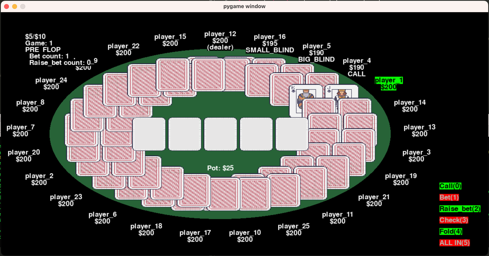

# Open Poker

[](https://pypi.org/project/gym-open-poker/)
[](https://opensource.org/licenses/MIT)

Welcome to the open-world Poker Simulator, a tool that includes novelty generators for open-world artificial intelligence (Open-world AI). This package relies on the following frameworks:

- [OpenAI Gym](https://github.com/openai/gym): Serving as the infrastructure for simulation environments.
- [Pygame](https://www.pygame.org/): Employed for visualization purposes.


<!---

The poker simulator screenshot.
-->


<p style="text-align: center;">The visualization of normal game mode.</p>


## Introduction
In complex task environments in both nature and human society, **structural** violations of expectation (VoE) occur with non-trivial frequency. Agents that are designed to operate in such environments must be capable of **open-world learning** (OWL), defined as the ability to detect and accommodate out-of-distribution inputs, as well as more complex structural VoEs, without requiring extensive and offline re-training. Until recently, OWL research was relatively constrained and limited to areas such as anomaly detection and concept drift. More recently, agent-based OWL research has witnessed much interest from across the community. To support this research, not just for developing OWL algorithms, but also evaluating them, there is a need for multi-agent environments where structural VoEs can be generated, and controlled experiments can be run with relative ease. To address this need, we propose PokerOWL, a platform that is supported on the Gymnasium infrastructure (formerly supported by OpenAI), which is extensively used in the reinforcement learning and AI gameplaying communities. PokerOWL supports both a rich VoE generator and a graphical interface for facilitating development and evaluation of OWL methods. 

## What does a novelty look like?

Explore one of the novelties we've crafted! Picture a scenario where 25 players engage in a game – would your strategy change? While this novelty may not be the optimal choice for illustrating the impact of novelty on players, it is the most visualizable. Our repository includes several other novelties, so feel free to interact with them and discover their unique dynamics!

## Getting Started
If you are unfamiliar with poker, these are some references for you as a novice.
- [Wiki](https://en.wikipedia.org/wiki/Poker)
- [Upswingpoker](https://upswingpoker.com/betting-rules/)

Within this software package, the implementation of Limit Texas Hold'em is provided. Some key properties of Limit Texas Hold'em:
- Fixed Betting Limits: The default betting structure is $10/$20. In other words, the small bet is $10 for the first two betting rounds, and the big bet is $20 for the last two betting rounds.
- Number of Raises: Only one bet and up to three raise bets are permissible during each betting round.


### Prerequisites
- Python 3.9 or above


### General User

1. Create virtual environment in your desired folder
```
python3 -m venv .env
source .env/bin/activate
```
2. User Installation
```
pip3 install gym-open-poker
```
3. Create execution file
```
touch exe.py
```
Copy the following into `exe.py`
```
import gym
import gym_open_poker
import os
import yaml
from gym_open_poker.envs.poker_util.novelty_generator import NoveltyGenerator

# load config parameters
config_path = './config.yaml'
if os.path.exists(config_path):
    with open(config_path, "r") as stream:
        try:
            config_dict = yaml.safe_load(stream)
        except yaml.YAMLError as exc:
            raise ValueError (f"{exc}")
else:
    config_dict = dict()

# original environment
env = gym.make("gym_open_poker/OpenPoker-v0", **config_dict)

# novelty injection
ng = NoveltyGenerator()

## print out supported novelies
print(ng.get_support_novelties())
## injecting
if config_dict['novelty_list'] and len(config_dict['novelty_list']) > 0:
    env = ng.inject(env, config_dict['novelty_list'])

# start gaming
observation, info = env.reset(seed=42)
print('============================')
print('---observation---')
print(observation)
print('---info---')
print(info)

while(True):
    print('============================')
    print('Enter your action:')
    user_action = input()
    while(int(user_action) not in range(6)):
        print(f'It is not a valid action, current value = {user_action}, please enter 0~5')
        user_action = input()
    #print('----------------')
    observation, reward, terminated, truncated, info = env.step(int(user_action))
    print('---observation---')
    print(observation)
    print('---reward---')
    print(reward)
    print('---info---')
    print(info)
    if truncated:
        print('meet termination condition! Over!')
        break
    if terminated:
        if observation['player_status'][observation['position'][1]] == 1:
            print('WINNNN!')
        else:
            print('LOST!')
        break
```
It is also possible to customize the parameters within the configuration file. You can make modifications to the following settings, save the file as config.yaml, and place it alongside the executable file.

5. Create config file
```
touch config.yaml
```
Copy the following into `config.yaml`
```
# --------log file path--------
log_file_path: './test.log'
# --------visualization parameters--------
render_mode: 'human'  # None or human
show_all_move_mode: True
visualize_debug_mode: False
# window_width: 1200
# window_height: 600
sleep_time: 0.5
# --------background agents--------
background_agents_raw_list:
  - agent_type: "agent_p"
    number_of_agent: 2
  - agent_type: "agent_dump"
    number_of_agent: 2
  - agent_type: "agent_random"
    number_of_agent: 0
# --------general pokers rules--------
# max_raise_count: 3
# small_blind: 5
# big_small_blind_ratio: 2 # big_blind = small_blind * big_small_blind_ratio
# seed: 15
# buy_in_amount: 100
# bankroll_limit: 1500
# --------termination conditions--------
# max_game_limitation: 999
# max_time_limitation: 999
# --------novelty list--------
novelty_list:
  # - novelty_name: card.CardDistHigh
  # - novelty_name: card.CardDistLow
  # - novelty_name: card.CardDistSuit
  #    param:
  #      prohibit_suit: "diamond"
  # - novelty_name: card.CardDistOdd
  #   param:
  #    prohibit_parity: "odd"
  # - novelty_name: card.CardDistColor
  #  param:
  #    prohibit_color: "red"
  # - novelty_name: conclude_game.Incentive
  #   param:
  #     amount: -100
   - novelty_name: conclude_game.Tipping
  #   param:
  #    ratio: 0.5
  # - novelty_name: conclude_game.SeatChanging
  # - novelty_name: conclude_game.LuckySeven
  #   param:
  #     amount: 100
  # - novelty_name:
  #    conclude_game.HiddenCard
  # - novelty_name: game_element.AllOdd
  # - novelty_name: game_element.BigBlindChange
  #   param:
  #     big_small_blind_ratio: 4
  # - novelty_name: game_element.BigBetChange
  #   param:
  #     big_small_bet_ratio: 4
  # - novelty_name: game_element.BuyIn
  #   param:
  #     buy_in_amount: 1000
  # - novelty_name: game_element.TournamentLength
  #  param:
  #    max_game_limitation: 10
  # - novelty_name: agent.AgentExchange
  # - novelty_name: agent.AddAgentR
  #   param:
  #     add_player_number: 2
  # - novelty_name: agent.AddAgentConservative
  #   param:
  #     add_player_number: 2
  # - novelty_name: agent.AddAgentAggressive
  #   param:
  #     add_player_number: 2
  # - novelty_name: agent.AddAgentStirring
  #   param:
  #     add_player_number: 2
  # - novelty_name: action.GameFoldRestrict
  # - novelty_name: action.NoFreeLunch
  # - novelty_name: action.ActionHierarchy
  # - novelty_name: action.WealthTax
  #   param:
  #      tax_ratio: 2
  # - novelty_name: action.RoundActionReStrict
  #   param:
  #     restricted_action: "fold"
  #     restricted_phase: "pre-flop"

```

6. execute pokerOWL
```
python3 exe.py
```


For example, setting ```visualize_debug_mode: True``` enables developers to directly see all players' cards, making it easier for development, as illustrated below:


<p style="text-align: center;">The visualization of debug game mode.</p>


### Developer 
1. Clone the repository:
```
git clone https://github.com/minhsueh/gym-open-poker.git
```
2. Navigate to the project directory:
```
cd gym-open-poker
```
3. Create virtual environment 
```
python3 -m venv .env
source .env/bin/activate
```
4. Install the package in editable mode:
```
pip3 install -e .
```
5. Install additional dependencies:
```
pip3 install -r requirements.txt
```

### Developer Execution
1. Navigate to the testing directory:
```
cd tests
```
2. Execute the simulator
original poker:
```
python3 test_experiment_original.py
```
novel poker: (Can you detect the difference from the original one?)
```
python3 test_experiment_novel_user_action.py
```
3. Post-analysis:
```
cat test.log
```


Final notes:
- You can modify the game parameters in config.yaml
- To ensure smooth execution when running multiple experiments with different novelties, it is recommended to manage the experiment process using Bash scripts. This approach is beneficial because the novelty generator alters the imported objects and functions in the code. Re-importing them is necessary to restore the original functions between experiments, ensuring consistent behavior.

The following Bash script `exe.sh` helps streamline the process of running experiments with different novelty names as input arguments. The script invokes the Python script `exe_with_input.py`, passing the novelty names directly as arguments.
``` bash
novelty_array=(
    card.CardDistColor
    conclude_game.Incentive
)
for((ni = 0; ni < ${#novelty_array[@]}; ni++))
do
    n1=${novelty_array[${ni}]}
    python3 exe_with_input.py "${ni}"
done
```
Execute bash file:
``` bash
bash exe.sh
```

## Authors
- Min-Hsueh Chiu - [GitHub](https://github.com/minhsueh)
- Mayank Kejriwal - [GitHub](https://github.com/mayankkejriwal)

## License
[MIT](https://choosealicense.com/licenses/mit/)