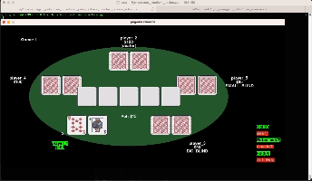
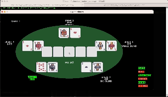

# Open Poker

[](https://pypi.org/project/gym-open-poker/)

Welcome to the open-world Poker Simulator, a tool that includes novelty generators for open-world artificial intelligence (Open-world AI). This package relies on the following frameworks:

- [OpenAI Gym](https://github.com/openai/gym): Serving as the infrastructure for simulation environments.
- [Pygame](https://www.pygame.org/): Employed for visualization purposes.


<!---

The poker simulator screenshot.
-->



The visualization of normal game mode.


The visualization of debug game mode.


## Getting Started
If you are unfamiliar with poker, these are some references for you as a novice.
- [Wiki](https://en.wikipedia.org/wiki/Poker)
- [Upswingpoker](https://upswingpoker.com/betting-rules/)

Within this software package, the implementation of Limit Texas Hold'em is provided. Some key properties of Limit Texas Hold'em:
- Fixed Betting Limits: The default betting structure is $10/$20. In other words, the small bet is $10 for the first two betting rounds, and the big bet is $20 for the last two betting rounds.
- Number of Raises: Only one bet and up to three raise bets are permissible during each betting round.


### Prerequisites
- Python 3.9 or above

### User Installation
```
pip3 install gym-open-poker
```

### User Execution
Sample script for running the simulator
```
import gym
import gym_open_poker
import os
import yaml
from gym_open_poker.wrappers import CardDistHigh, CardDistLow # novelty modules

# load config parameters
config_path = './config.yaml'
if os.path.exists(config_path):
    with open(config_path, "r") as stream:
        try:
            config_dict = yaml.safe_load(stream)
        except yaml.YAMLError as exc:
            print(exc)
else:
    config_dict = dict()

env = gym.make("gym_open_poker/OpenPoker-v0", **config_dict)
# env = CardDistLow(gym.make("gym_open_poker/OpenPoker-v0", **config_dict)) # novelty inject
observation, info = env.reset(seed=42)
print('============================')
print('---observation---')
print(observation)
print('---info---')
print(info)

while(True):
    print('============================')
    print('Enter your action:')
    user_action = input()
    if int(user_action) not in range(6):
        print('It is not a valid action, current value = ' + user_action)
        continue
    #print('----------------')
    observation, reward, terminated, truncated, info = env.step(int(user_action))
    print('---observation---')
    print(observation)
    print('---reward---')
    print(reward)
    print('---info---')
    print(info)
    if truncated:
        print('meet termination condition! Over!')
        break
    if terminated:
        if observation['player_status'][observation['position'][1]] == 1:
            print('WINNNN!')
        else:
            print('LOST!')
        break
```
It is also possible to customize the parameters within the configuration file. You can make modifications to the following settings, save the file as config.yaml, and place it alongside the executable file.
```
# --------log file path--------
log_file_path: './test.log'
# --------visualization parameters--------
render_mode: 'human'  # None or human
show_all_move_mode: False
visualize_debug_mode: True
# window_width: 1200
# window_height: 600
sleep_time: 0.5
# --------background agents--------
background_agents_raw_list:
  - agent_type: "agent_p"
    number_of_agent: 1
  - agent_type: "dump_agent"
    number_of_agent: 4
  - agent_type: "agent_random"
    number_of_agent: 1
# --------general pokers rules--------
# max_raise_count: 3
# small_blind: 5
# big_small_blind_ratio: 2 # big_blind = small_blind * big_small_blind_ratio
# seed: 15
# buy_in_amount: 100
# bankroll_limit: 1500
# --------termination conditions--------
# max_game_limitation: 999
# max_time_limitation: 999
```


### Development Installation
1. Clone the repository:
```
git clone https://github.com/minhsueh/gym-open-poker.git
```
2. Navigate to the project directory:
```
cd gym-open-poker
```
3. Install the package in editable mode:
```
pip3 install -e .
```
4. Install additional dependencies:
```
pip3 install -r requirements.txt
```

### Development Execution
1. Navigate to the testing directory:
```
cd test
```
2. Execute the simulator
original poker:
```
python3 test_experiment.py
```
novel poker: (Can you detect the difference from the original one?)
```
python3 test_novel_experiment.py
```
3. Post-analysis:
```
cat test.log
```


Note:
- You can modify the game parameters in config.yaml

## Authors
- Min-Hsueh Chiu - [GitHub](https://github.com/minhsueh)
- Mayank Kejriwal - [GitHub](https://github.com/mayankkejriwal)

## License
[MIT](https://choosealicense.com/licenses/mit/)