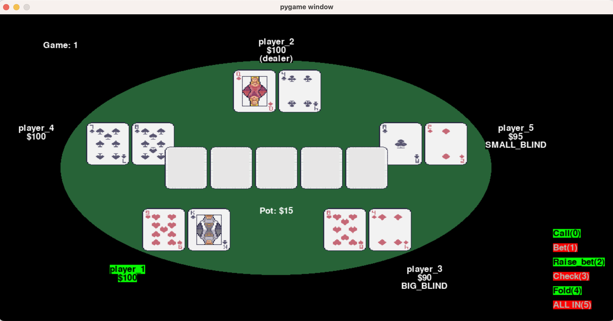

Welcome to the open-world Poker Simulator, a tool that includes a novelty generator for open-world artificial learning. This package leverages [OpenAI Gym] (https://github.com/openai/gym) and Pygame for an immersive experience.

The poker simulator screenshot.

<video src="https://github.com/minhsueh/OpenAI_gym_poker/videos/normal.mp4"></video>
The visualization of normal game mode.

<video src="https://github.com/minhsueh/OpenAI_gym_poker/videos/debug_mode.mp4"></video>
The visualization of debug game mode.
